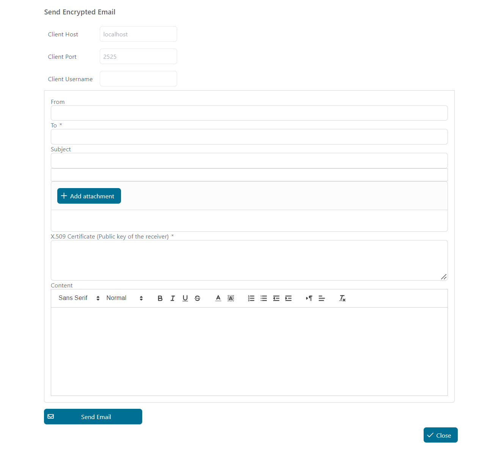

# Email encryption Demo

**Email encryption Demo**  is a demo to send an encrypted email to a specific email address.

## Demo

In this Demo, you will be able to send an encrypted email.



1. Start the SendEncryptedEmail process.

2. Fill in the email form.

3. Set the public key of the receiver.

4. Send the email.

## Setup

### CREATE SELF SIGNED S/MIME CERTIFICATE

First you will need to install OpenSSL on windows, and you can download it from here: [OpenSSL](http://gnuwin32.sourceforge.net/packages/openssl.htm) 

All the commands should be run from command prompt under the installation directory in BIN folder:

```

C:\OpenSSL-Win64\bin

```

First, let’s create a self-sign certificate and a private authority valid for 365 days:

```

openssl req -x509 -newkey rsa:4096 -keyout encrypted.email.key -out encrypted.email.crt -sha256 -days 365

```

Fill all the information in the wizard to create the certificate using the password for the private key


Now you have created self-signed certificate with the Private authority, but outlook, thunderbird and other email client use `p12` certificate style, so let's create this kind of certificate:

```

openssl pkcs12 -export -inkey encrypted.email.key -in encrypted.email.crt -out encrypted.email.p12

```

Enter the password you have created for the private key before. Now you have all the certificates you will need. To trust those certificates, you will need to install them on your email client.

### Install an S/MIME Certificate with Outlook

Installing the certificate on outlook as describe very nicely at [Installing an s-mime certificate with outlook](https://www.ssl.com/how-to/installing-an-s-mime-certificate-and-sending-secure-email-with-outlook-on-windows-10) 

1. In Outlook, select File from the main menu, then click Options.

2. Select **Trust Center** at the bottom of the menu on the left side.

3. Click the **Trust Center Settings** button.

4. Select **Email Security** from the left-hand menu of the **Trust Center** window. 


5. Click the **Import/Export** button, under **Digital IDs (Certificates)**.

6. Make sure **Import existing Digital ID from a file** is checked, then click **Browse...** 


7. Navigate to the PKCS#12 file, then click **Open**. The filename extension should be .p12

8. Enter the password you used when downloading the PKCS#12 file, then click **OK**.

### Install an S/MIME Certificate with Thunderbird

1. Open **Account Settings**

2. Select **End-To-End Encryption**

3. Click on **Manage S/MIME Certificates** 


4. Click on **Import...**

5. Navigate to the PKCS#12 file, then click **Open**. The filename extension should be `.p12`

6. Enter the password you used when downloading the `PKCS#12` file, then click **OK**.

