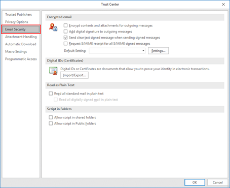
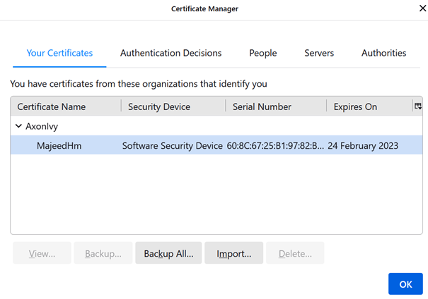

# Email Encryption Demo

Axon Ivy's email encryption utility provides you with a sample implementation for sending encrypted emails from any business process.

This market item:

- gives you a template for sending encrypted emails via a preconfigured form.
- is based on the OpenSSL library, featuring open-source implementations of the SSL and TLS protocols.


## Demo

In this demo application, you will be able to send an encrypted emails directly from your UI form in any of your business processes.


1. Start the SendEncryptedEmail process.

2. Fill in the email form.

3. Set the public key of the receiver.

4. Send the email.

## Setup

### Create Self Signed S/MIME certificate

First you will need to install OpenSSL on windows. You can download the library from here: [OpenSSL](http://gnuwin32.sourceforge.net/packages/openssl.htm) 

All the commands should be run from the command prompt under the installation directory in the BIN folder:

```

C:\OpenSSL-Win64\bin

```

First, let’s create a self-sign certificate and a private authority valid for 365 days:

```

openssl req -x509 -newkey rsa:4096 -keyout encrypted.email.key -out encrypted.email.crt -sha256 -days 365

```

Fill in all the information in the wizard to create the certificate using the private key password:


Now you have created a self-signed certificate with the private authority, but MS Outlook, Thunderbird, and other email clients use the `p12` certificate style. Therefore, let's create this kind of certificate:

```

openssl pkcs12 -export -inkey encrypted.email.key -in encrypted.email.crt -out encrypted.email.p12

```

Enter the password you have created for the private key. Now you have all the certificates you will need. To trust those certificates, you will need to install them on your email client.

### Install an S/MIME certificate for MS Outlook

Installing the certificate for MS Outlook is described here: [Installing an s-mime certificate with outlook](https://www.ssl.com/how-to/installing-an-s-mime-certificate-and-sending-secure-email-with-outlook-on-windows-10) 

1. In MS Outlook, select File from the main menu, then click Options.

2. Select **Trust Center** at the bottom of the menu on the left side.

3. Click the **Trust Center Settings** button.

4. Select **Email Security** from the left-hand menu of the **Trust Center** window. 



5. Click the **Import/Export** button, under **Digital IDs (Certificates)**.

6. Make sure **Import existing Digital ID from a file** is checked, then click **Browse...** 


7. Navigate to the PKCS#12 file, then click **Open**. The filename extension should be .p12

8. Enter the password you used when downloading the PKCS#12 file, then click **OK**.

### Install an S/MIME Certificate on Thunderbird email client

1. Open **Account Settings**.

2. Select **End-To-End Encryption**.

3. Click on **Manage S/MIME Certificates**.



4. Click on **Import...**.

5. Navigate to the PKCS#12 file, then click **Open**. The filename extension should be `.p12`.

6. Enter the password you used when downloading the `PKCS#12` file, then click **OK**.

