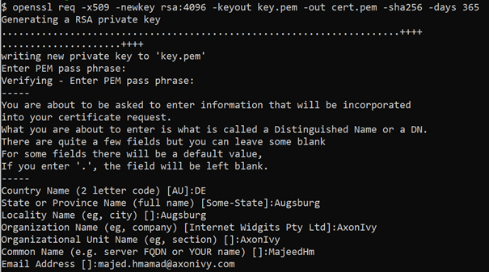
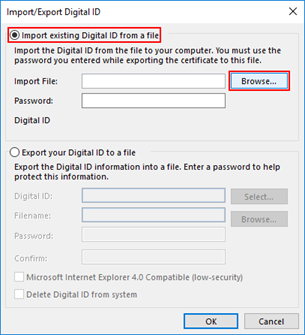

# E-Mail-Verschlüsselungs-Demo

Das E-Mail-Verschlüsselungsprogramm von Axon Ivy bietet Ihnen eine
Beispielimplementierung für das Versenden verschlüsselter E-Mails aus beliebigen
Geschäftsprozessen.

Dieser Marktartikel:

- bietet Ihnen eine Vorlage zum Versenden verschlüsselter E-Mails über ein
  vorkonfiguriertes Formular.
- basiert auf der OpenSSL-Bibliothek, die Open-Source-Implementierungen der SSL-
  und TLS-Protokolle enthält.

## Demo

In dieser Demo-Anwendung können Sie verschlüsselte E-Mails direkt aus Ihrem
UI-Formular in jedem Ihrer Geschäftsprozesse versenden.


1. Starten Sie den Prozess „SendEncryptedEmail”.

2. Füllen Sie das E-Mail-Formular aus.

3. Legen Sie den öffentlichen Schlüssel des Empfängers fest.

4. Senden Sie die E-Mail.

## Setup

### Erstellen Sie ein selbstsigniertes S/MIME-Zertifikat.

Zunächst müssen Sie OpenSSL unter Windows installieren. Sie können die
Bibliothek hier herunterladen:
[OpenSSL](http://gnuwin32.sourceforge.net/packages/openssl.htm)

Alle Befehle sollten über die Eingabeaufforderung im Installationsverzeichnis im
Ordner „BIN” ausgeführt werden:

```

C:\OpenSSL-Win64\bin

```

Zunächst erstellen wir ein selbstsigniertes Zertifikat und eine private
Zertifizierungsstelle mit einer Gültigkeit von 365 Tagen:

```

openssl req -x509 -newkey rsa:4096 -keyout encrypted.email.key -out encrypted.email.crt -sha256 -days 365

```

Geben Sie alle Informationen im Assistenten ein, um das Zertifikat mit dem
Passwort für den privaten Schlüssel zu erstellen:



Sie haben nun ein selbstsigniertes Zertifikat mit der privaten Behörde erstellt,
aber MS Outlook, Thunderbird und andere E-Mail-Clients verwenden das Zertifikat
im Stil „ `p12` ”. Erstellen wir daher ein solches Zertifikat:

```

openssl pkcs12 -export -inkey encrypted.email.key -in encrypted.email.crt -out encrypted.email.p12

```

Geben Sie das Passwort ein, das Sie für den privaten Schlüssel erstellt haben.
Jetzt haben Sie alle erforderlichen Zertifikate. Um diese Zertifikate als
vertrauenswürdig einzustufen, müssen Sie sie in Ihrem E-Mail-Client
installieren.

### Installieren Sie ein S/MIME-Zertifikat für MS Outlook.

Die Installation des Zertifikats für MS Outlook wird hier beschrieben:
[Installation eines S-MIME-Zertifikats mit
Outlook](https://www.ssl.com/how-to/installing-an-s-mime-certificate-and-sending-secure-email-with-outlook-on-windows-10)

1. Wählen Sie in MS Outlook im Hauptmenü „Datei“ und klicken Sie dann auf
   „Optionen“.

2. Wählen Sie „ **“ „Trust Center“ „** “ unten im Menü auf der linken Seite.

3. Klicken Sie auf die Schaltfläche „ **Trust Center Settings“
   (Vertrauensstellungscenter-Einstellungen) „** “ (Vertrauen für diese Website
   gewähren).

4. **Wählen Sie im linken Menü des Fensters „ **Trust Center“ (** ) die Option
   „E-Mail-Sicherheit“ (Email Security) und dann
   „E-Mail-Sicherheitseinstellungen“ (** ) aus.


5. ** Klicken Sie auf die Schaltfläche „ **“ (Import/Export von Zertifikaten)
   unter „ **“ (Zertifikate) „Digital IDs (Certificates)“ (Digitale IDs
   (Zertifikate)) „** “ (Zertifikate).

6. Stellen Sie sicher, dass „ **“ (Bestehende digitale ID aus einer Datei
   importieren) und „** “ (Datei auswählen) aktiviert sind, und klicken Sie dann
   auf „ **“ (Datei auswählen) und „Browse...“ (Durchsuchen).**



7. Navigieren Sie zur PKCS#12-Datei und klicken Sie dann auf „ **“ (Datei
   hinzufügen). Öffnen Sie „** “ (Datei hinzufügen). Die Dateiendung sollte .p12
   lauten.

8. Geben Sie das Passwort ein, das Sie beim Herunterladen der PKCS#12-Datei
   verwendet haben, und klicken Sie dann auf „ **“ (OK) „** “ (OK).

### Installieren Sie ein S/MIME-Zertifikat auf dem E-Mail-Client Thunderbird.

1. Öffnen Sie **Kontoeinstellungen**.

2. Wählen Sie „ **“ (End-to-End-Verschlüsselung) „** “ (Verschlüsselte Dateien).

3. Klicken Sie auf „ **“ (S/MIME-Zertifikate verwalten) „** “
   (S/MIME-Zertifikate verwalten).


4. Klicken Sie auf „ **“ Importieren...**.

5. Navigieren Sie zur PKCS#12-Datei und klicken Sie dann auf „ **“
   (PKCS#12-Datei öffnen). Öffnen Sie „** “ (PKCS#12-Datei). Die
   Dateinamenerweiterung sollte „ `.p12“ lauten.`.

6. Geben Sie das Passwort ein, das Sie beim Herunterladen der Datei „ `PKCS#12`
   ” verwendet haben, und klicken Sie dann auf „ **” und „OK”**.

