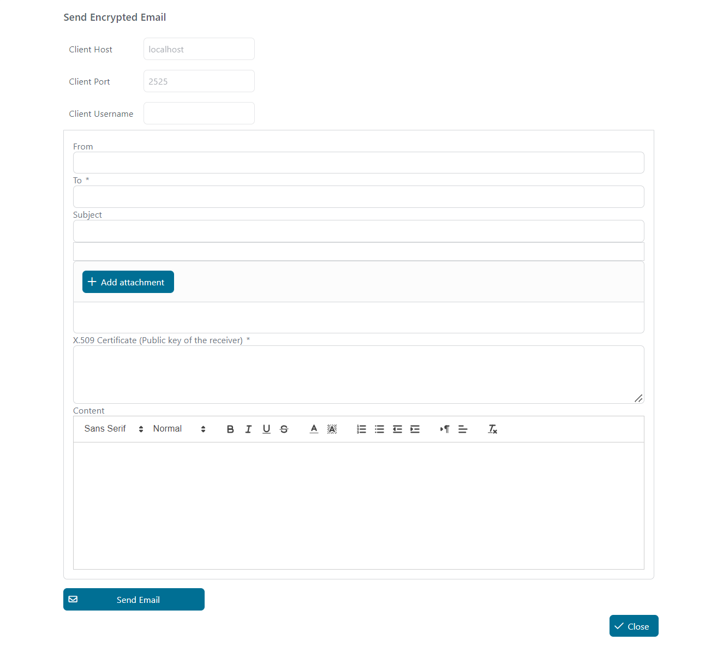
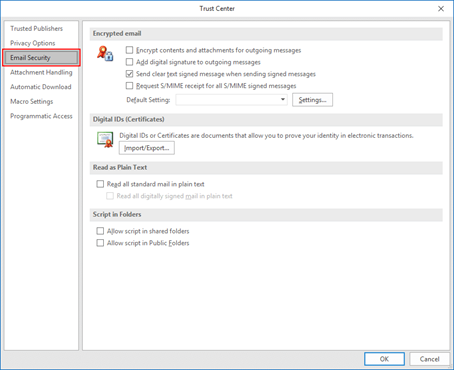
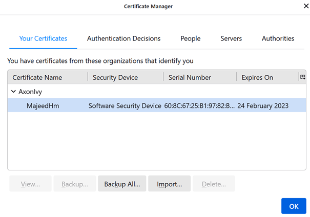

# E-Mail Encryption Demo

Axon Ivy's E-Mail Encryption-Utility zeigt Dir eine Beispielimplementierung zum Senden verschlüsselter E-Mails aus jedem Geschäftsprozess. 

Dieses Market-Item:

- gibt Dir eine Vorlage zum Senden verschlüsselter E-Mails über ein vorkonfiguriertes Formular.
- basiert auf der OpenSSL-Bibliothek mit Open-Source-Implementierungen der SSL- und TLS-Protokolle.

## Demo

In dieser Demo-Anwendung kannst Du direkt aus Deinem UI-Formular in einem Deiner Geschäftsprozesse verschlüsselte E-Mails senden.



1. Starte den `SendEncryptedEmail`-Prozess.

2. Fülle das E-Mail-Formular aus.

3. Setze den öffentlichen Schlüssel des Empfängers.

4. Sende die E-Mail.

## Einrichtung

### Erstelle ein selbst signiertes S/MIME-Zertifikat

Zuerst musst Du OpenSSL unter Windows installieren. Du kannst die Bibliothek hier herunterladen: [OpenSSL](http://gnuwin32.sourceforge.net/packages/openssl.htm)

Alle Befehle sollten über die Eingabeaufforderung im Installationsverzeichnis im BIN-Ordner ausgeführt werden:

```
C:\OpenSSL-Win64\bin
```

Zuerst erstellen wir ein selbst signiertes Zertifikat und eine private Autorität, gültig für 365 Tage:

```
openssl req -x509 -newkey rsa:4096 -keyout encrypted.email.key -out encrypted.email.crt -sha256 -days 365
```

Fülle alle Informationen im Wizard aus, um das Zertifikat mit dem privaten Schlüsselpasswort zu erstellen:


Jetzt hast Du ein selbst signiertes Zertifikat mit der privaten Autorität erstellt, aber MS Outlook, Thunderbird und andere E-Mail-Clients verwenden das `p12`-Zertifikatsformat. Lass uns daher diese Art von Zertifikat erstellen:

```
openssl pkcs12 -export -inkey encrypted.email.key -in encrypted.email.crt -out encrypted.email.p12
```

Gib das Passwort ein, das Du für den privaten Schlüssel erstellt hast. Jetzt hast Du alle benötigten Zertifikate. Um diesen Zertifikaten zu vertrauen, musst Du sie in Deinem E-Mail-Client installieren.

### Installiere ein S/MIME-Zertifikat für MS Outlook

Die Installation des Zertifikats für MS Outlook wird hier beschrieben: [Installing an s-mime certificate with outlook](https://www.ssl.com/how-to/installing-an-s-mime-certificate-and-sending-secure-email-with-outlook-on-windows-10) 

1. In MS Outlook, wähle **Datei** aus dem Hauptmenü und klicke dann auf **Optionen**.

2. Wähle **Trust Center** am unteren Ende des Menüs auf der linken Seite.

3. Klicke auf die Schaltfläche **Trust Center Einstellungen**.

4. Wähle **E-Mail Sicherheit** aus dem Menü auf der linken Seite des **Trust Center**-Fensters. 



5. Klicke auf die Schaltfläche **Importieren/Exportieren** unter **Digitale IDs (Zertifikate)**.

6. Stelle sicher, dass **Existierende Digitale ID aus einer Datei importieren** aktiviert ist, und klicke auf **Durchsuchen...** 


7. Navigiere zur PKCS#12-Datei und klicke auf **Öffnen**. Die Dateierweiterung sollte `.p12` sein.

8. Gib das Passwort ein, das Du beim Herunterladen der PKCS#12-Datei verwendet hast, und klicke auf **OK**.

### Installiere ein S/MIME-Zertifikat im Thunderbird E-Mail-Client

1. Öffne die **Kontoeinstellungen**.

2. Wähle **End-To-End Verschlüsselung**.

3. Klicke auf **S/MIME-Zertifikate verwalten**.



4. Klicke auf **Importieren...**.

5. Navigiere zur PKCS#12-Datei und klicke auf **Öffnen**. Die Dateierweiterung sollte `.p12` sein.

6. Gib das Passwort ein, das Du beim Herunterladen der `PKCS#12`-Datei verwendet hast, und klicke auf **OK**.
